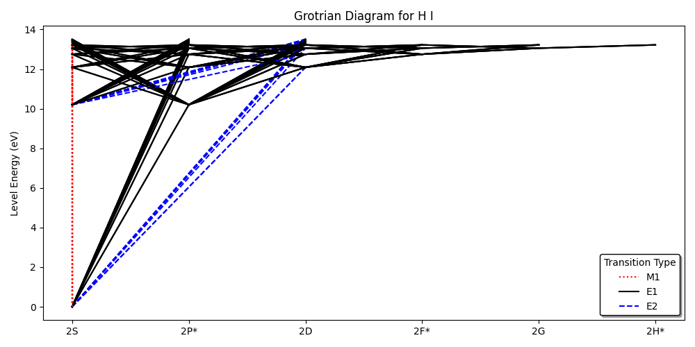

Please check out the [documentation page](https://Autumn10677.github.io/ASDtools/)!

## ___About ASDtools___

This package relies heavily on __[astroquery.nist](https://astroquery.readthedocs.io/en/latest/nist/nist.html)__'s querying capabilities for loading spectral data for a given element over a range of wavelengths. The main advantage of __ASDtools__ is its ability to format astroquery's default output into a formatted DataFrame. Additionally, I have made a handful of helpful tools for visualizing several pieces of the NIST ASD. This __ASDtools__'s primary goal is to help users understand and visualize standard conventions in atomic spectroscopy.

__NOTE:__ As of writing (March 31, 2025), __[reports have surfaced that the NIST ASD is expected to go offline](https://www.wired.com/story/nist-doge-layoffs-atomic-spectroscopy/)__. If the database is unavailable for querying, compressed files containing the entire database have been saved and uploaded to this GitHub repository. I will modify the behavior of __ASDtools__ to use this data as a backup.

## ___Installation___
__ASDtools__'s dependencies are...

```
'astropy',
'astroquery',
'Fraction',
'ipython!=8.17.1,<9.0.0,>=8.13.0',
'matplotlib',
'numpy<2',
'pandas',
'periodictable',
'roman',
'sympy',
'tqdm'
```

To install __ASDtools__, just run a pip installation...

```
$ python pip install ASDtools
```

## ___Basic Usage (How to Query)___
Since __ASDtools__ uses __astroquery.nist__ to pull its data, it takes the same arguments. However, __ASDtools__ uses a class-based data structure to store and modify NIST ASD data. You must create a new "NIST_lines" instance to initialize a query. This initialization takes the same arguments as __astroquery.nist__...

```
>>> import ASDtools as asdt
>>> lines = asdt.NIST_lines(["He I", "He II"], lower_wavelength=3000*u.AA, upper_wavelength=9000*u.AA)
>>> lines.df
```

In contrast to the raw table produced by __astroquery.nist__, the output from the above call...

- Has column names w/ explicitly stated units (for ease of use)
- Numeric columns (i.e., "Observed (nm)," "Aki," etc.) now have NaN values instead of empty strings
- Some columns w/ multiple pieces of data have been split up (i.e., "Ei (eV)" and "Ek (eV)")
- Empty entries in the "Transition Type" column now have an explicit type
- Numeric columns no longer contain non-numeric characters (see description of "flags")

These changes reflect some of the struggles I faced when working with data from NIST's ASD. I hope to improve the readability and usefulness of __ASDtools__ in future iterations.

## ___What Else Can ASDtools do?___

### 1. Flag Identification & Explanation
One advantage of __ASDtools__ is its ability to identify, filter out, and explain non-numeric "flags" found throughout the NIST ASD. These allow the user to filter out lines based on certain undesired characteristics (i.e., forbidden, blended, etc.). You can also use an in-built class function to explain the number of flags found along with their meaning...
```text
>>> lines = asdt.NIST_lines("O I", keep_flag_columns=True)
>>> lines.explain_column_flags("Rel.")

   Flag: *
 Counts: 28
Meaning: Intensity is shared by several lines (typically, for multiply classified lines).

   Flag: bl
 Counts: 3
Meaning: Blended with another line that may affect the wavelength and intensity.
```

### 2. Produce Ground-State Electronic Configurations

To help understand the way NIST's ASD formats electronic configurations, I made a handful of functions that explain what electronic configurations are. One tool automatically draws an __[Aufbau diagram](https://chem.libretexts.org/Bookshelves/Introductory_Chemistry/Introductory\_Chemistry\_(CK-12)/05%3A\_Electrons\_in\_Atoms/5.15%3A\_Aufbau\_Principle)__ to visually-demonstrate the filling order of subshells...
```
>>> asdt.draw_aufbau_diagram(N_max=5)
```


A separate tool generates the filling order according to Aufbau's principle...
```
>>> asdt.find_filling_order(max_level=5, joined=True)

'1s.2s.2p.3s.3p.4s.3d.4p.5s'
```

And another tool automatically calculates the ground-state electronic configuration for any element/ionization pair. This function can return an abbreviated electronic configuration, and can use two separate ordering schemas...
```
>>> asdt.find_electronic_config("O I", abbreviate=True, sortby="fill order")

'[He]2s2.2p4'
```
__NOTE:__ The current version of __ASDtools__ does not take into account a handful of notable exceptions to the filling order outlined above. I plan on fixing this in a future iteration.

### 3. Calculate All Possible Term Symbols

The NIST ASD provides a handful of term symbols, each with a slightly different meaning. For many elements, a single term symbol is given to represent the entire electronic configuration. In other cases (particularly for heavier elements), term symbols are provided for smaller chunks of an electronic configuration. The following function calculated all possible term symbols for a given element/ionization pair...
```
>>> config = asdt.find_electronic_config("Ni I")
>>> asdt.generate_term_symbols(config)
```
These term symbols are displayed using LaTeX formatting. These match NIST's ASD for lines that assume an LS-coupling scheme. A term symbol function for other schemes is not available yet. The methodology used to calculate term symbols follows **[this Wikipedia article](https://en.wikipedia.org/wiki/Term_symbol#Term_symbol_parity)** pretty closely.

### 4. Draw Grotrian Diagrams

Finally, ASDtools can draw a Grotrian diagram (a.k.a., energy level diagram) for a given element. If multiple multiplicities are found, they are separated from one another on the same plot. The current format reflects the style of Grotrian diagrams I have seen in classes up until this point, but I hope to include more options in future iterations.
```
>>> asdt.draw_grotrian_diagram("H I")
```

